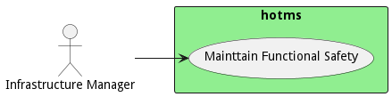

# Infrastructure Manager

Infrastructure Manager is responsible for the functional safety of the OT environment.

Infrastructure managers manage the infrastructure, including level 0 and level 1 machines and devices. They utilize
Level 3 plant managers to evaluate the operating conditions of the machines and devices in the OT infrastructure. They
are primarily responsible for critical infrastructure and functional safety of the plant.

## Use Cases

* [Mainttain Functional Safety](usecase-MainttainFunctionalSafety)

## User Interface
TBD

## Command Line Interface
* [ hotms data govern](action--hotms-data-govern) - Mainttain Functional Safety is the description

