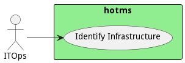

# ITOps

This is the traditional IT operations engineer.

IT operations are responsible for managing network devices. And storage across the company’s Infrastructure. Most IT
organizations are also responsible for traditional disaster recovery and business continuity. However, this typically
does not apply to OT operation’s infrastructure.

## Use Cases

* [Identify Infrastructure](usecase-IdentifyInfrastructure)

## User Interface
TBD

## Command Line Interface
* [ hotms data govern](action--hotms-data-govern) - Identify the infrastructure includes noting hardware, software and firmware.

