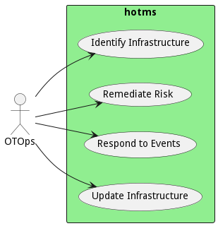

# OTOps

OT Operations is responsible for managing the OT network and devices.

Operations are responsible for operational technology infrastructure. Primarily level 0 through Level 3. Devices. And
network connectivity in the OT infrastructure. Typically come from the OT. Space, including understanding machines,
controllers, and the devices that manage them. However, they are not responsible for the connectivity to the IT
networks. And traditionally, they do not handle cyber security. 

## Use Cases

* [Identify Infrastructure](usecase-IdentifyInfrastructure)
* [Remediate Risk](usecase-RemediateRisk)
* [Respond to Events](usecase-RespondtoEvents)
* [Update Infrastructure](usecase-UpdateInfrastructure)

## User Interface
TBD

## Command Line Interface
* [ hotms data govern](action--hotms-data-govern) - Identify the infrastructure includes noting hardware, software and firmware.
* [ hotms data govern](action--hotms-data-govern) - Remediate Risk for OT infrastructure is fundamentally different from IT remediation because Functional Safety is a critical factor when analyzing risk.
* [ hotms data govern](action--hotms-data-govern) - Respond to Events includes responding to cyber, digital and physical events in the environment.
* [ hotms data govern](action--hotms-data-govern) - Update Infrastructure is similar to traditional IT update infrastructure but includes machines, controllers, devices, firmware,operating systems, and software stacks.

