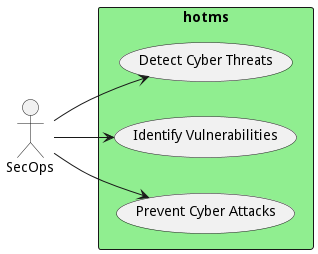

# SecOps

Traditional securiton operations engineer responsible for securing the environment.

Security operations are responsible for threat detection and threat prevention. And remediation of cyber security
threats against the company's assets. Traditionally focused on IT infrastructure., more emphasis is now being placed on
IoT infrastructure and cybersecurity threats in this unique environment.

## Use Cases

* [Detect Cyber Threats](usecase-DetectCyberThreats)
* [Identify Vulnerabilities](usecase-IdentifyVulnerabilities)
* [Prevent Cyber Attacks](usecase-PreventCyberAttacks)

## User Interface
TBD

## Command Line Interface
* [ hotms data govern](action--hotms-data-govern) - Detect Cyber Threats extends traditional IT cyber threat detection techniques.
* [ hotms data govern](action--hotms-data-govern) - Identify Vulnerabilities focuses on network, host, and access control settings.
* [ hotms data govern](action--hotms-data-govern) - Prevent Cyber Attacks is traditional IT cyber prevention with the addition of specific OT controls.

