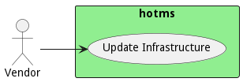

# Vendor

This is the OT machine, controller or device vendor that will monitor and update the system.

Vendors play an essential role in OT infrastructure management because many vendors need access to machines and
controllers to update and patch devices when things go wrong or updates to the software. Firmware or hardware are
required. Many times this includes physical access to machines. Other times it could be connectivity or virtual access.

## Use Cases

* [Update Infrastructure](usecase-UpdateInfrastructure)

## User Interface
TBD

## Command Line Interface
* [ hotms data govern](action--hotms-data-govern) - Update Infrastructure is similar to traditional IT update infrastructure but includes machines, controllers, devices, firmware,operating systems, and software stacks.

