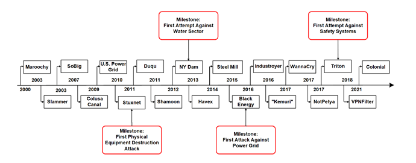
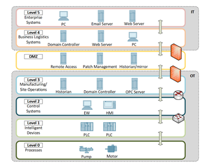
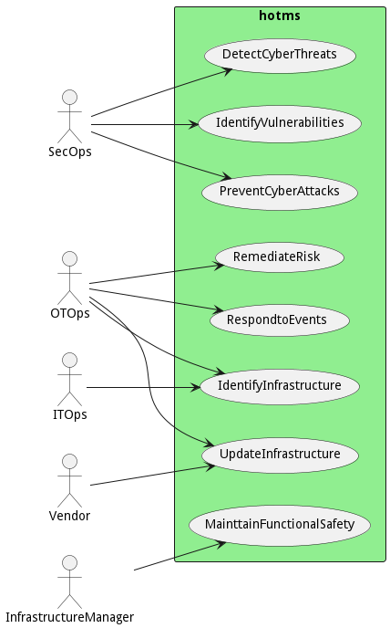
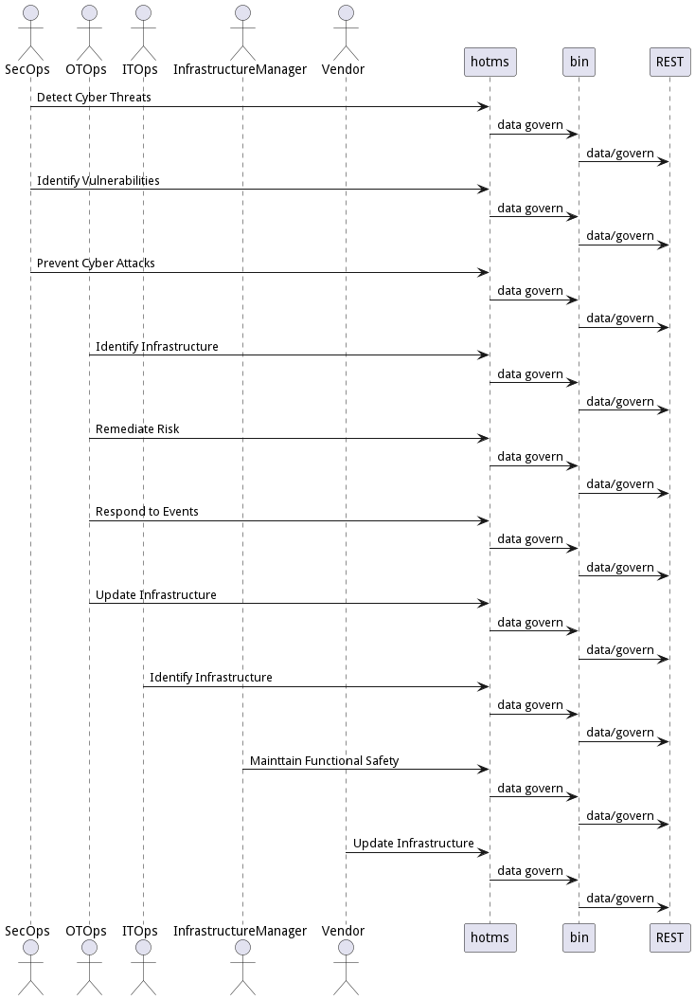
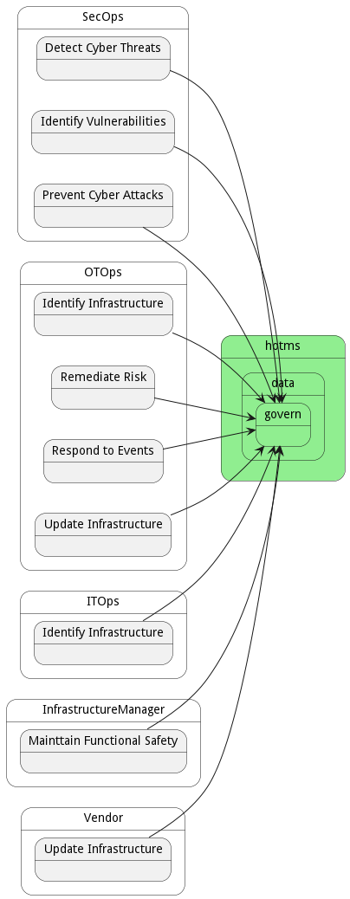
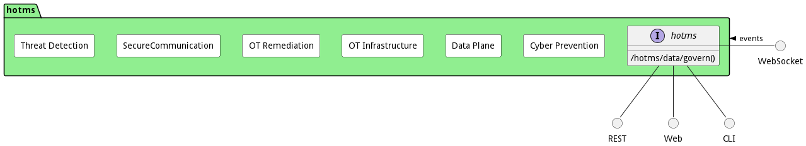

# hotms

Hardened OT Managed Security is a holistic security solution focused on effectively managing OT infrastructure using the best practices from the IT world.

## Problem Statement

Over the last five years, there has been exponential growth in cyber-attack activity targeting Critical infrastructure.
An increasing number of these attacks have been successful in shutting down critical infrastructure all over the
world [[1]](#1) . Four factors are converging that increase the importance of hardened cyber-security position, namely:
increased essential sophistication of infrastructure systems and ransomware attacks; IT security best practices do not
map to OT security vulnerabilities and issues, government regulations and compliance, and the need to use data analytics
to optimize critical infrastructure.

### Increased Sophistication of Attacks

Cyber-criminals have increased the types of attacks and the frequency of attacks on critical infrastructure. Some recent
successes have encouraged cyber-criminals and nation-states to increase their focus on critical infrastructure for
monetary gain, terrorism, and physical attacks on other nation-states.
The STUXNET attack is one of the most famous cyber-attacks on Critical OT infrastructure. This sophisticated attack took
advantage of the widespread traditional OT airgap network strategy and infiltrated OT systems worldwide using multiple
zero-day vulnerabilities on USB flash drives.
This highly successful attack has emboldened several attacks over the last decade, including attacks on different
critical infrastructure sectors, including the water sector, power grid, safety systems, and oil and gas [[1]](#1). See
[[Figure 1]](#fig1) 1 for a timeline of OT cyber-attacks over the last 20 years

|                         |
|:-------------------------------------------------------------:|
| <a id='fig1'>Figure 1:</a> OT Cyber Attack of the 21st Centry |

### OT Security Issues

OT infrastructure has different security issues than traditional IT infrastructure. Because OT infrastructure is typical
machines that manipulate the real world (motors, HVAC, pumps, sensors, etc.), they can affect the physical world in
which we live and potentially cause injury or death. The motivation foundation of infrastructure managers and OT
operations are fundamentally different from IT in three key areas: functional safety is the highest priority,
reliability of OT devices and network is vital to functional safety, and highly heterogeneous OT devices.

#### Functional Safety is the highest priority of industrial control systems.

Functional safety is OT operation’s primary concern when working with critical infrastructure systems. Functional safety
refers to the physical world being affected by the OT infrastructure. For example. Landing lights on a runway. Not
properly working could cause delays at an airport or even loss of life.
Functional safety is so important to some organizations that systems are shut down to mitigate the risk of significant
physical disasters in the sight of uncertainty. Most recently, an infection of a cyber virus in the IT network and
potential exposure to the OT network shutdown of the Colonial Pipeline caused gas shortages across the mid-Atlantic
coast of the United States.

#### Reliability of CI’s devices and network is vital to guarantee system safety.

Many OT critical infrastructure systems’ “lack of control” can cause functional safety issues. Even though many critical
systems have fail-safes to prevent physical destruction with the loss of machines or controllers, service disruption can
cause secondary and tertiary side effects.
Even though these fail-safes protect the system, the secondary and tertiary side effects can be profound, like loss of
electricity, gas shortages leading to increased gas prices, food processing plants shutting down leading to loss of tons
of food, and increased prices at the store. Sometimes these secondary and tertiary effects are precisely the
cybercriminals’ goals.
Critical infrastructure has much higher demands on reliability and uptime than traditional IT infrastructure due to
these scenarios.

#### Operational Technology (OT) Devices are different from IT devices.

IT security risk mitigation is very different from IT mitigation strategies, where traditionally infected nodes can
simply be shut down, and the workloads migrated to other devices. Several key differences between OT devices and IT
devices compound the risk mitigation and management of OT infrastructure.

* Legacy infrastructure is measured in decades, not years.
* Much longer lifecycle than IT devices.
* OT devices and networks are physically dispersed.
* Highly heterogeneous, including machines, controllers, devices, networks, and capabilities.
* OT device vendors have proprietary systems with custom or outdated operating systems and applications.
* Industrial communication protocols have not been designed with security in mind. No, inherent encryption of data.
* Some legacy OT devices do not talk network IP.
* It is challenging to manage and maintain distributed OT devices
* Traditionally, OT networks are air-gapped from IT networks to prevent cyberattacks.
* Cyber-attacks are “jumping” air-gapped networks with zero-day vulnerabilities in software, firmware, and operating
  system patches.
* New cyberattacks are taking advantage of unpatched vulnerabilities in OT networks.

### IT Security is not the same as OT security.

Most IT cybersecurity professionals leverage IT cybersecurity best practices on OT infrastructure without fully
understanding their differences. The following two sections show the typical techniques for IT cyber security and the OT
concerns that fundamentally differ from IT best practices.

#### IT cyber security techniques

Even though there are several different cybersecurity techniques, this paper will describe and compare and contrast
these techniques with OT operators’ concerns.

* Cyber Threat Detection – primarily focuses on network and host scanning for patterns of cyber intrusion.
* Cyber Prevention – primarily focuses on network management, network controls, and access management, including the
  proper configuration of routers, firewalls, and micro-segmented networks. This also includes malware and endpoint
  protection software.
* Risk remediation includes quarantine, investigation, and rebuild. Does not take into consideration functional safety.
* Patch and update management focuses on the high frequency of patch updates to firmware, operating systems, and
  software.

#### OT Operations Concerns

Typically, OT operations express concerns about injecting it. Cyber security best practices in their OT networks. The
following is a list of some common problems.

* Cyber Threat Detection on OT networks monitors different kinds of traffic than IT networks.
* OT networks contain highly heterogeneous devices.
* Most of the data on OT networks can’t be encrypted because the overhead of encrypting on old devices is too high.
* OT networks are protected because they are air-gapped networks,
* Cannot take out sections of critical infrastructure. Safety and reliability concerns.
* Software and firmware patches are risky for functional safety and security concerns. Patching impacts reliability and
  safety
* There are several vendors and types of devices, OS(s), and applications. Where IT infrastructure is relatively
  homogeneous.
* Physically disperse systems with significantly long lifecycles.
* OT machine and device vendors have a protectionism position with proprietary systems. This disjointed industry is not
  moving to standard infrastructure and security standards.

### Government Regulations

Because governments see critical infrastructure affecting their citizens’ safety, economies, and national security,
governments have begun to regulate OT and critical infrastructure cyber security. Governments are concerned not only
with computing and data infrastructure but also physical infrastructure.
Some industries like transportation have adopted their cyber security frameworks to protect these industries from
catastrophic cyberattacks further. The following is a brief list of the most prominent security frameworks with a quick
overview of each framework.

#### TSA Cyber Security Framework [[2]](#2)

This cyber security framework targets the transportation industry in the United States and heavily leverages the NIST
cyber security standards. However, it does emphasize functional safety as part of the cyber security position and
remediation plans.

#### TS50701 – European OT Cyber Security [[3]](#3)

This European cyber security standard is very similar to the TSA cyber security framework, focusing on rail systems and
their functional safety regarding cyber security, including several remediation strategies.

#### IEC 62443-4-2 - Component Security Assurance [[4]](#4)

This international standard focuses on cyber security at the component level in OT infrastructure. It primarily focuses
on individual machines, controllers, and devices, providing a common cyber security position across entities for
automation and control purposes.

#### NIST SP 800-82r3 [[5]](#5)

Most of the other standards have based their frameworks on this NIST standard. The primary goal is to implement a
repeatable and auditable process to protect critical infrastructure through best practices in identifying, detecting,
responding, and recovering. Additionally, the framework proposes five layers of architecture, including security
management, physical security, network security, hardware security, and software security.

### Business Intelligence through Data Analytics

Over the last decade, critical infrastructure has been augmented with intelligent IoT devices adding new types of
sensors and compute power at the edge. This augmentation has increased the amount of data generated at the edge giving
Infrastructure managers additional information to manage their critical systems.

However, the increased volume of data requires more data analytics tools and compute resources that traditional OT
infrastructure does not have available. Additionally, OT data in isolation does not provide a complete operational
picture; injection of internal and external data is required. This desire to build more business decision information
from OT data drives the breakdown of OT isolation.

## Traditional Purdue Model

In the 1990s, a security and infrastructure model was created that most OT organizations still follow today. This model,
named the Purdue model, describes the bridge between the IT and OT infrastructure through six levels that show a
traditional air gap between the four levels of OT infrastructure and two groups in IT infrastructure. See [Figure 2]
(#fig2) for a high-level view of the traditional Purdue model.

|                | 
|:------------------------------------------------:|
| <a id='fig2'>Figure 2</a> Purdue Model [[1]](#1) |

The following is a brief description of each of the Levels.

* Level 0 – Devices that manipulate the physical world. Like pumps and motors.
* Level 1 – Devices that control level 0 machines, like PLC (Programmable logic controller)
* Level 2 – Control systems used to supervise the physical processes, basically controlling the Level 1 devices. This
  includes human-machine interfaces and engineering workstations.
* Level 3 – Manufacturing and site operation machines used to manage production workflow and facility-wide control.
  These manage level 2 devices.
* DMZ – Demilitarized zone is used to prevent direct communications between IT and OT networks.
* Level 4 – Business and planning logistics system to oversee IT operations supporting OT processes. This includes MRP
  and ERP systems.
* Level 5 – The IT enterprise network used for production and resource data exchange.

This traditional Purdue has been in place over the last 30 years and is starting to show its age. As IoT devices become
more intelligent, many lower levels 0-2 are starting to collapse, increasing capabilities at the edge. Additionally,
these new devices are piercing through DMZ to talk directory to Levels 4 and 5 in the IT infrastructure [[6]](#6).
Even though the Purdue model has served its purpose over the years, it is starting to break down as Cyber criminals are
exploiting the hard-shell soft center paradigm of the model. Changes to the traditional OT isolation must be
re-evaluated and re-engineered.

## Use Case Model Analysis

Capturing actors and use cases of this system helps better understand the scope. Of the architecture and its impact on
operations. The following two sections detail the system’s actors and their use cases. See Figure 3 Use case Diagram for
more information.

|          |
|:----------------------------------------------:|
| <a id='fig3'>Figure 3</a> High Level Use Cases |

## References

|                     | Reference                                                                                                                                                                                                                  |
|---------------------|----------------------------------------------------------------------------------------------------------------------------------------------------------------------------------------------------------------------------|
| <a id="1">[1]</a>   | G. Makrakis, C. Kolias, G. Kambourakis, C. Rieger and J. Benjamin, "Industrial and Critical Infrastructure Security: Technical Analysis of Real-Life Security Incidents," IEEE Access Access, pp. 165295-165325, 2021.     |
| <a id="2">[2]</a>   | TSA, "Surface Transporation Cybersecurity Toolkit," TSA DHS, Dec 2021. [Online]. Available: https://www.tsa. gov/for-industry/surface-transportation-cybersecurity-toolkit.                                                |
| <a id="2">[3]</a>   | EU Standards, "Railway applications -Cybersecurity," CLC/TS 50701, 2020.                                                                                                                                                   |
| <a id="2">[4]</a>   | ISASecure, "Component Security Assurance (CSA) - version 1.0.0," 2019. E                                                                                                                                                   |
| <a id="2">[5]</a>   | K. Stouffer, M. Pease, C. Tang, T. Zimmerman, V. Pillitteri, and S. Lightman, "Guide to Operational Technology (OT) 3," NIST SP 800-92r3, 20222.                                                                           |
| <a id="2">[6]</a>   | D. Greenfield, "Is the Purdue Model Still Relevant?," AutomationWorld, 12 May 2020. [Online]. Available: https://www.automationworld.com/factory/iiot/article/21132891/is-the-purdue-model-still-relevant.                 |
| <a id="2">[7]</a>   | T. Nuth, "Fighting for holistic IT, OT security," 29 May 2017. [Online]. Available: https://www. controleng. com/articles/fighting-for-holistic-it-ot-security/.                                                           |
| <a id="2">[8]</a>   | S. D. Antón and H. D. Schotten, "Putting Together the Pieces: A Concept for Holistic Industrial Intrusion Detection.", Proceedings of the European Conference on Cyber Warfare & Security, Kaiserslautern, Germany, 2019.  |
| <a id="2">[9]</a>   | A. Akbarzadeh and S. Katsikas, "Unified IT&OT Modeling for Cybersecurity Analysis of Cyber-Physical Systems, " IEEE Open Journal of the Industrial Electronics Society, vol. 3, pp. 318-328, 2022.                         |
| <a id="2">[10]</a>  | S. M. Belal, "The Top 7 Operational Technology Patch Management Best Practices," 2021. [Online]. Available: https://gca.isa.org/blog/the-top-7-operational-technology-patch-management-best-practices.                     |
| <a id="2">[11]</a>  | CISA, "Critical Manufacturing Sector Security Guide," Cybersecurity and Infrastructure Security Agency, June 2020.                                                                                                         |
| <a id="2">[12]</a>  | How secure is Your Plant: A Holistic OT Cybersecurity Toolkit for Industry 4.0. [Film]. Engineering USA, 2021.                                                                                                             |
| <a id="2">[13]</a>  | V. Kumar and C. Gupta, "Cyber Security Issue in Smart Grid," in 2021 IEEE 4th International Conference on Computing, Power and Communication Technologies, Roorkee, India, 2021.                                           |
| <a id="2">[14]</a>  | U. Masud, "OT Patch Management Strategy: Seven Best Practices," 2021. [Online]. Available: https://www.rockwellautomation.com/en-us/company/news/blogs/ot-patch-management-strategy--seven-best-practices.html.            |
| <a id="2">[15]</a>  | D. Palmer, "Manufacturing is becoming a major target for ransomware attacks," 13 Nov 2020. [Online]. Available: https://www.zdnet.com/article/manufacturing-is-becoming-a-major-target-for-ransomware-attacks.             |
| <a id="2">[16]</a>  | K. Stouffer, T. Zimmerman, C. Tang, J. Lubell, J. Cichonski and J. McCarthy, "Cybersecurity Framework Manufacturing Profile," NIST IR 8183, p. 50, 2017.                                                                   |
| <a id="2">[17]</a>  | Verve, "Verve Industrial for OT/ICS Patch Management," 2022. [Online]. Available: https://verveindustrial.com/verve-security-center/patch-management/.                                                                     |

## Use Cases

The following are the use cases of the hotms subsystem. Each use case has primary and secondary scenarios
that are elaborated in the use case descriptions.

* [Detect Cyber Threats](usecase-DetectCyberThreats)
* [Identify Infrastructure](usecase-IdentifyInfrastructure)
* [Identify Vulnerabilities](usecase-IdentifyVulnerabilities)
* [Mainttain Functional Safety](usecase-MainttainFunctionalSafety)
* [Prevent Cyber Attacks](usecase-PreventCyberAttacks)
* [Remediate Risk](usecase-RemediateRisk)
* [Respond to Events](usecase-RespondtoEvents)
* [Update Infrastructure](usecase-UpdateInfrastructure)

## Users

The following are the actors of the hotms subsystem. This can include people, other subsystems
inside the solution and even external subsystems.

* [SecOps](actor-secops)
* [OTOps](actor-otops)
* [ITOps](actor-itops)
* [InfrastructureManager](actor-im)
* [Vendor](actor-vendor)

## Interface

The subsystem has a REST, CLI, WebSocket, and Web interface. Use Cases and Scenarios can use any or all
of the interfaces to perform the work that needs to be completed. The following  diagram shows how
users interact with the system.

* [ hotms data govern](#action--hotms-data-govern)

## Logical Artifacts

The Data Model for the  hotms subsystem shows how the different objects and classes of object interact
and their structure.

### Sub Packages

The hotms subsystem has sub packages as well. These subsystems are logical components to better
organize the architecture and make it easier to analyze, understand, design, and implement.

* [Cyber Prevention](package--hotms-cp)
* [Data Plane](package--hotms-dp)
* [OT Infrastructure](package--hotms-oi)
* [OT Remediation](package--hotms-or)
* [SecureCommunication](package--hotms-s)
* [Threat Detection](package--hotms-td)

### Classes

The following are the classes in the data model of the hotms subsystem.

## Deployment Architecture

This subsystem is deployed using micro-services as shown in the diagram below. The 'micro' module is
used to implement the micro-services in the system. The subsystem also has an CLI, REST and Web Interface
exposed through a nodejs application. The nodejs application will interface with the micro-services and
can monitor and drive work-flows through the mesh of micro-services. The deployment of the subsystem is
dependent on the environment it is deployed. This subsystem has the following environments:
* [dev](environment--hotms-dev)
* [test](environment--hotms-test)
* [prod](environment--hotms-prod)

## Physical Architecture

The hotms subsystem is physically laid out on a hybrid cloud infrastructure. Each microservice belongs
to a secure micro-segmented network. All of the micro-services communicate to each other and the main app through a
REST interface. A Command Line Interface (CLI), REST or Web User interface for the app is how other subsystems or actors
interact. Requests are forwarded to micro-services through the REST interface of each micro-service. The subsystem has
the a unique layout based on the environment the physical space. The following are the environments for this
subsystems.
* [dev](environment--hotms-dev)
* [test](environment--hotms-test)
* [prod](environment--hotms-prod)

## Micro-Services

These are the micro-services for the subsystem. The combination of the micro-services help implement
the subsystem's logic.

### dev

Detail information for the [dev environment](environment--hotms-dev)
can be found [here](environment--hotms-dev)

Services in the dev environment

* pubsub : redis
* admin : hotms:latest
* child : child_image:latest
* web : hotms_web
* doc : hotms_doc

### test

Detail information for the [test environment](environment--hotms-test)
can be found [here](environment--hotms-test)

Services in the test environment

* pubsub : redis
* admin : hotms:latest
* child : child_image:latest
* web : hotms_web
* doc : hotms_doc

### prod

Detail information for the [prod environment](environment--hotms-prod)
can be found [here](environment--hotms-prod)

Services in the prod environment

* pubsub : redis
* admin : hotms:latest
* child : child_image:latest
* web : hotms_web
* doc : hotms_doc

## Activities and Flows
The hotms subsystem provides the following activities and flows that help satisfy the use
cases and scenarios of the subsystem.

### Messages Handled

The hotms subsystem is an event driven architecture and handle several events. The following
events are handled by this subsystem. Please note that this subsystem is not the only subsystem that handles
these events.

| Message | Action | Description |
| --- | --- | --- |

### Messages Sent

| Event | Description | Emitter |
|-------|-------------|---------|

## Interface Details
The hotms subsystem has a well defined interface. This interface can be accessed using a
command line interface (CLI), REST interface, and Web user interface. This interface is how all other
subsystems and actors can access the system.

### Action  hotms data govern

* REST - /hotms/data/govern?attr1=string
* bin -  hotms data govern --attr1 string
* js - .hotms.data.govern({ attr1:string })

#### Description
Description of the action

#### Parameters

| Name | Type | Required | Description |
|---|---|---|---|
| attr1 | string |false | Description for the parameter |

