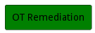
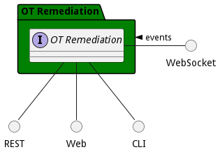
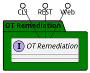

# OT Remediation

OT Remediation is fundamentally different from IT remediation because of the functional safety concerns with critical infrastructure.

Remediation in OT infrastructure is fundamentally different than IT infrastructure. This is primarily due to the
functional safety aspect of OT infrastructure. The traditional IT approach to remediation includes quarantining infected
nodes and moving workloads to uninfected homogeneous infrastructure. Because OT infrastructure controls the physical
world, functional safety is critical to OT operations.

OT remediation should enable different modes of remediation that may include degraded operations, isolation at levels 2
and 3 in the Purdue model, the shutdown of complete systems, or any number of safety protocols defined in the event
response action plan. Because there are so many factors affecting OT remediation, it must be captured and managed. This
subsystem is responsible for capturing and automating, where possible, the action responses for cyber, digital, and
physical events in the environment.

## Use Cases

The following are the use cases of the OT Remediation subsystem. Each use case has primary and secondary scenarios
that are elaborated in the use case descriptions.

## Users

The following are the actors of the OT Remediation subsystem. This can include people, other subsystems
inside the solution and even external subsystems.

## Interface

The subsystem has a REST, CLI, WebSocket, and Web interface. Use Cases and Scenarios can use any or all
of the interfaces to perform the work that needs to be completed. The following  diagram shows how
users interact with the system.

## Logical Artifacts

The Data Model for the  OT Remediation subsystem shows how the different objects and classes of object interact
and their structure.

### Sub Packages

The OT Remediation subsystem has sub packages as well. These subsystems are logical components to better
organize the architecture and make it easier to analyze, understand, design, and implement.

### Classes

The following are the classes in the data model of the OT Remediation subsystem.

## Deployment Architecture

This subsystem is deployed using micro-services as shown in the diagram below. The 'micro' module is
used to implement the micro-services in the system. The subsystem also has an CLI, REST and Web Interface
exposed through a nodejs application. The nodejs application will interface with the micro-services and
can monitor and drive work-flows through the mesh of micro-services. The deployment of the subsystem is
dependent on the environment it is deployed. This subsystem has the following environments:
* [local](environment--hotms-or-local)
* [dev](environment--hotms-or-dev)
* [test](environment--hotms-or-test)
* [prod](environment--hotms-or-prod)

## Physical Architecture

The OT Remediation subsystem is physically laid out on a hybrid cloud infrastructure. Each microservice belongs
to a secure micro-segmented network. All of the micro-services communicate to each other and the main app through a
REST interface. A Command Line Interface (CLI), REST or Web User interface for the app is how other subsystems or actors
interact. Requests are forwarded to micro-services through the REST interface of each micro-service. The subsystem has
the a unique layout based on the environment the physical space. The following are the environments for this
subsystems.
* [local](environment--hotms-or-local)
* [dev](environment--hotms-or-dev)
* [test](environment--hotms-or-test)
* [prod](environment--hotms-or-prod)

## Micro-Services

These are the micro-services for the subsystem. The combination of the micro-services help implement
the subsystem's logic.

### local

Detail information for the [local environment](environment--hotms-or-local)
can be found [here](environment--hotms-or-local)

Services in the local environment

* web : _or_web

### dev

Detail information for the [dev environment](environment--hotms-or-dev)
can be found [here](environment--hotms-or-dev)

Services in the dev environment

* web : _or_web

### test

Detail information for the [test environment](environment--hotms-or-test)
can be found [here](environment--hotms-or-test)

Services in the test environment

* web : _or_web

### prod

Detail information for the [prod environment](environment--hotms-or-prod)
can be found [here](environment--hotms-or-prod)

Services in the prod environment

* web : _or_web

## Activities and Flows
The OT Remediation subsystem provides the following activities and flows that help satisfy the use
cases and scenarios of the subsystem.

### Messages Handled

The OT Remediation subsystem is an event driven architecture and handle several events. The following
events are handled by this subsystem. Please note that this subsystem is not the only subsystem that handles
these events.

| Message | Action | Description |
| --- | --- | --- |

### Messages Sent

| Event | Description | Emitter |
|-------|-------------|---------|

## Interface Details
The OT Remediation subsystem has a well defined interface. This interface can be accessed using a
command line interface (CLI), REST interface, and Web user interface. This interface is how all other
subsystems and actors can access the system.

