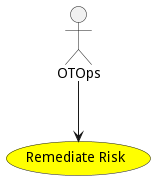

# Remediate Risk

Remediate Risk for OT infrastructure is fundamentally different from IT remediation because Functional Safety is a critical factor when analyzing risk.

## Actors

* [OTOps](actor-otops)

## Detail Scenarios

