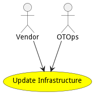

# Update Infrastructure

Update Infrastructure is similar to traditional IT update infrastructure but includes machines, controllers, devices, firmware,operating systems, and software stacks.

## Actors

* [Vendor](actor-vendor)
* [OTOps](actor-otops)

## Detail Scenarios

